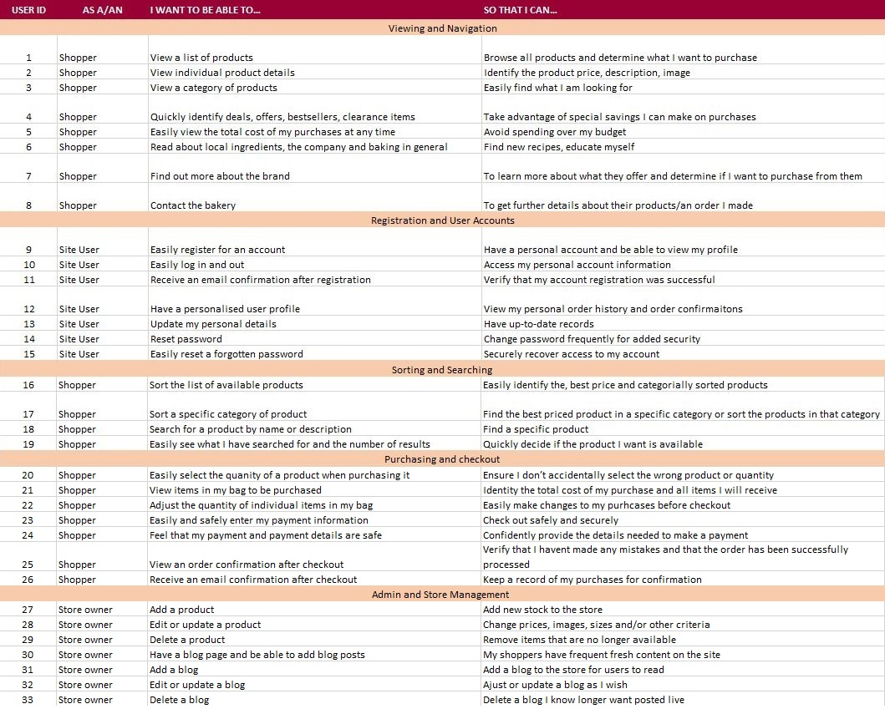
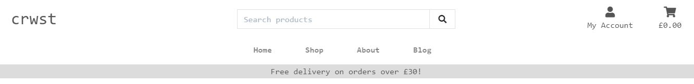
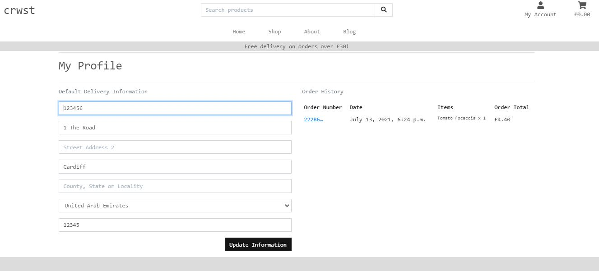
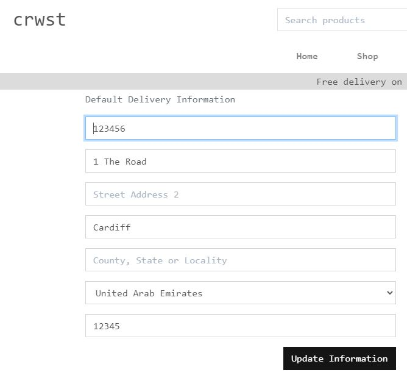
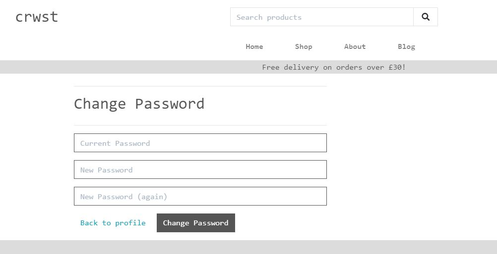
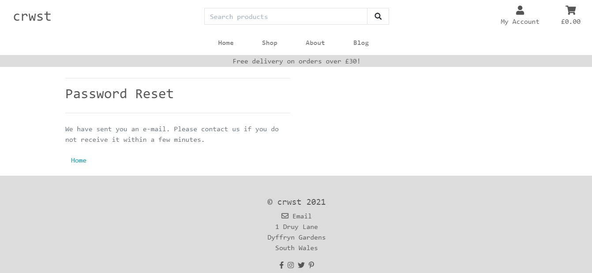
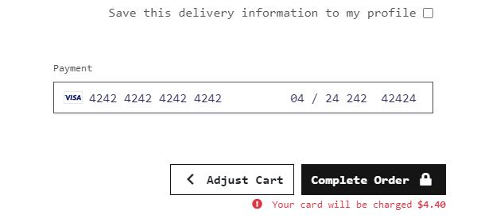
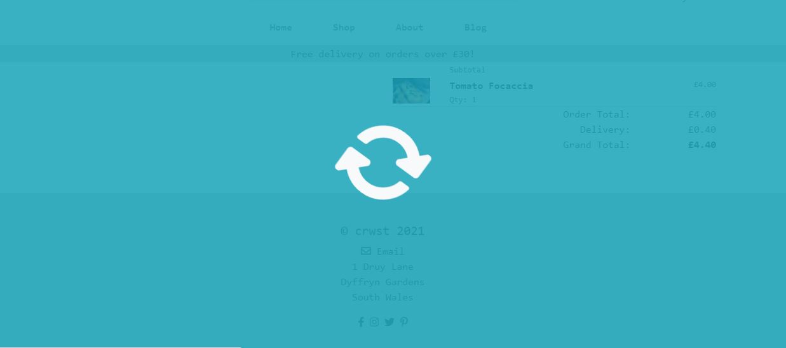
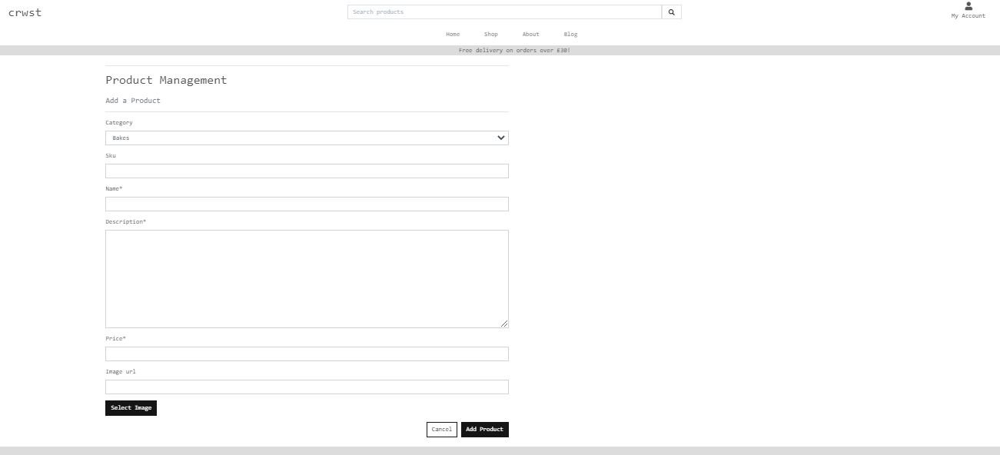
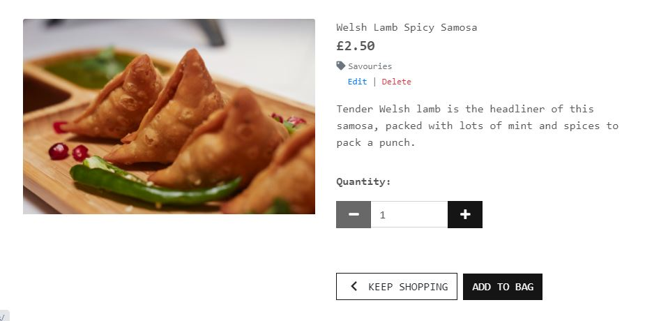

# Crwst project

The main goal for this project was to produce a full-stack web-development site based around business logic used to control a centrally-owned dataset, to set up an authentication mechanism and provide paid access to the site's data and/or activities based on the dataset, such as the purchase of a product/service. The site has been built using HTML, CSS, JavaScript, Python, Django, MySQL and Stripe.

A live version of the site can be found [here](https://crwst.herokuapp.com)

The main aim of this site it to provide the user with an online bakery inventory of items of food that they can purchase. The products have been split into 3 categories; Bakes, Bread and Savouries. The site is flexible and further products can be added. The site owner also has the ability to add blog posts and both them and registered users can comment on these blogs to form a discussion.

**For testing purposes, please use the following credit card details:**

Note that Stripe is test stage and not activated.

`Card number:` 4242 4242 4242 4242 

`Exp:` 4242 (MM YY) 
` CSV:`  any 3 numbers, ie. 424 

---

## **Contents**

* [UX](#ux)
  * [Project Aims](#project-aims)
  * [User and Site owner stories](#user-and-site-owner-stories)
  * [UX Design](#ux-design)
    * [Strategy](#strategy)
    * [Structure](#structure)
    * [Skeleton](#skeleton)
    * [Surface](#surface)
* [UI](#ui)
  * [Colours](#colours)
  * [Fonts](#fonts)
  * [Wireframes](#wireframes)
* [Technologies Used](#technologies-used)
  * [Languages and Frameworks](#languages-and-frameworks)
  * [Tools](#tools)
* [Features](#features)
  * [Existing Features](#existing-features)
  * [Features to implement](#features-to-implement)
* [Database Design](#database-design)
* [Testing and Debugging](#testing-and-debugging)
  * [Manual Testing](#manual-testing)
  * [Automated Testing](#automated-testing)
  * [User Testing](#user-testing)
* [Deployment](#deployment)
  * [Hosting](#hosting)
  * [AWS](#aws)
  * [Local Hosting](#local-hosting)
* [Credits](#credits)
  * [Code](#code)
  * [Images](#images)

---

## UX

### Project Aims 

This is a full-stack site for fictional company Crwst which is a local bakery that has entered into ecommerce following an online commerce surge with the COVID-19 pandemic. ‘Crwst’ is a Welsh translation of ‘pastry’.

The aim of this site is to offer the inventory of a bakery so that users can browse and securely purchase goods online. Users are able to view all products on one page, sort by 3 different categories; bakes, bread, savouries, as well as sort their search by price, alphabetically and categorically alphabetically. Each product has a link to it’s own product page where a user can see a description, toggle the quantity they want and add the item(s) to their basket. Users can see what is in their shopping cart at anytime in the top right corner and can securely checkout using Stripe. Each interaction has a pop up toast for feedback. Site owners can add, edit and delete products as well as add, edit and delete blog posts. Registered users also have the ability to comment on blogs. Unregistered users will be promoted with a redirect link to sign up. 

Value provided:

Users/Shoppers make use of the site by being able to order products that would be delivered to them. 

Site owners are able to increase their market exposure and customer base by gaining an online presence and offering. This should increase their revenue. 

Research from [Bakery Info](https://bakeryinfo.co.uk/bakery-market-report/bakery-market-report-2021-reveals-impact-of-covid/655314.article) and  [Simply Business]( https://simplybusiness.co.uk/knowledge/articles/2019/09/great-british-bake-off-uk-independent-bakeries-rise/) shows that since 2018, independent bakery businesses have increased in number by 48%. This means it is imperative that local bakery businesses have at least an online presence and where possible an online store to ensure they can compete for their market share. COVID-19 has resulted in the close of many businesses, including hospitality where baked goods are often sold, so an online presence is more important than ever. Food to go was slightly insulated due to its very nature of being low contact and transactional however, it is predicted that following the pandemic there will be a rise in eating out, therefore online shops must optimise their potential to maximise sales. 

### User and Site Owner Stories

[Back to Contents](#contents)

### UX Design

### Strategy 

To start I created a competitive benchmark to compare other bakeries that had an online presence and store to help determine what is this companies USP. What can it do that helps it stand out and increase customers. I have compared multiple bakery websites, including those that do and don’t have an online purchase ability, to determine how their sites are structured, how they separate their products into categories, how they structure their navigation, UI styles and what information they provide to users about products and their profiles and orders. 

* https://www.fabulouswelshcakes.co.uk/ 

Fabulous Welsh Cakes is a Welsh bakery with an online presence and store. They sell different flavoured Welsh-cakes and giftsets and offer bespoke services such as Wedding favours and corporate gifts. They have a clear shop page and include a page in their navigation that shows the different locations where shoppers can purchase in store if they wish. They don’t offer product sorting but have two categories; welsh-cakes and gifts. They have a subtle UI in terms of earthly colours and light delicate font and have gentle interactive actions where on hover the images flip. Their shop link is second in the navigation following the Home which shows its important and clear for the user to find.

* https://www.parsonsbakery.co.uk/  

South West and Wales bakery chain Parsons have a bold and engaging website, with a hero image and lots of visually interesting content. There is no online store however the site is very informative about the brand and includes location information for shoppers. They have a page where you can find locations of their sites. 

* https://hard-lines.co.uk/

Hardlines is a South Wales café that has an online presence and online store. Their UI and graphics are very contemporary and the tone of voice is aimed at young professionals. They have a full products page, individual pages for products with clear pricing, drop down options for quantity and weights. These are coloured and sized appropriately for contrast and hierarchy. However, they do not have a search function on their site which closes off many potential user stories. They have a log in and order history capability too. The sort, search and simplicity of their categories work really well and is something I have taken into this project. 

* https://friends-in-knead.myshopify.com/ 

Friends In Knead are a bakery with a physical store, a online presence and online store. Their site has soft and welcoming UI. When a shopper selects the Shop in navigation they are taken to a page of categories and when selected they are shown the products, I think it would be better UX to be first taken to a full page of products then decide on how to sort. This would assist the site owner in that a user is exposed to more products and may be tempted to purchase more. Each product has its own page with a price and Add to Cart button, however there is no quantity option. Once added to cart, you are immediately taken to your bag, which is not great user experience – a toast with a link would have been a better experience so that the shopper can continue to shop if they wish. They have customer favourites on the homepage, however there are 20 products which is too much choice for a new user.

From this brand comparison and market research key tasks/cases for the site are as below in this strategy trade off: 

|   | Features | Importance | Viability |
| :-: | --------------------------------- |:-------------:| :--------:|
| A | Search function for products by keyword or ingredient | 5 | 5 |
| B | View full product inventory | 5 | 5 |
| C | View individual product details on own page | 5 | 5 |
| D | Information about the brand | 4 | 5 |
| E | Secure user registration and log in and out functionality | 5 | 4 |
| F | User profile with ability to see order history | 5 | 4 |
| G | Securely checkout | 5 | 4 |
| H | Search result product sorting | 4 | 3 |
| I | Find a wholesaler/locations | 2 | 3 |
| J | User ability to save and/or like products in a wishlist | 2 | 3 |
| K | Link to email marketing subscriptions | 2 | 3 |
| L | Contact form | 2 | 3 |
| M | Visible special offers | 5 | 5 |
| N | Provide birthday discounts to registered users | 1 | 2 |
| O | Provide a blog page and view individual blogs | 4 | 5 |
| P | Allow registered users to comment on blogs | 3 | 5 |
|   |  *Total* |  59  | 62  | 

As the importance is higher than the viability this is going to work. The features that are that are the most important and achievable are: 

| A | Search function for products by keyword or ingredient 

| B | View full product inventory 

| C | View individual product details on own page

| D | Information about the brand

| E | Secure user registration and log in and out functionality

| F | User profile with ability to see order history

| G | Securely checkout 

| H | Search result product sorting 

| M | Visible special offers 

| O | Provide a blog page and view individual blogs 

| P | Allow registered users to comment on blogs 

The other features can be released in future updates. 

The user will expect to be able to intuitively find products, update their cart and securely checkout. They may want to read blog posts on recipes, local information and ingredients etc. 

Therefore the navigation should be intuitive and simple. Global navigation will be used for conventionality. Key call to actions will have obvious UI styling with secondary actions have more subtle. For example, ‘Add to Cart’ will be a dark button, whereas ‘Keep Shopping’ will be an outline.  

A special offers banner will appear in the base template and therefore be on every page enticing the user to buy. 

From the menu the user can find products and sort them by category, price, and alphabetically. 

A search bar will be on the base template and as such every page so a user can quickly search for a product at any point. This searches the titles of products and their descriptions to widen the search. 

The blog posts will help the brand appear trustworthy and interest local shoppers. Registered users will be able to comment on blogs. The idea being that users viewing the blog will be able to partake in discussions.  Site owners will be able to add, edit and delete blogs. Users can also search for a blog, by title or description in its own search (separate to products).

Users will be able to securely register and login. The site owner/superuser can add/edit/delete products and blogs.

Stripe is used so users can securely checkout. 

### Scope 

Based on the strategy plane, the key features that are the most important for users and the most achievable are providing information about the brand and the service, a search function that allows a user to find specific products by title or in description. The results are shown on cards that give key information about the product; a clear image, price, category, which the user can then click into to view an individual product page. Users can securely register and log in, they also have a profile page where they can update their default shipping details and view their previous order history. Users can search for and read blogs and registered users can comment on them and form a dialogue. Security has been added so non registered users can add blogs and products and only registered users can checkout. 

The site needs to appear trustworthy and intuitive. It wants to be as helpful and knowledgeable as it can to users by enticing new users, being easy to use for return users so that the number of recipes increases. The company requires a website that expresses its professionality, reliability and trustworthy. 

The website must be a clear showcase of the brand. It should have contemporary features and aesthetic that appeals to potential customers. 

### Structure 

Of the key elements that were determined important, they should be put in this logical order on the site: 

* Search function for products
* Clear link to shop in menu and view all products
* Clear sort and category options in shop menu
* View of shopping cart with ability to update quantities, see total and delivery charge
* Ability to register/log in 
* Profile with default details and order history
* Information about the brand’s service
* Site owner ability to add, edit and delete products and blogs 
* Blog posts and comment ability 

The Home page will be the landing page with search function, menu and a clear call to action to all products. This will include a top navigation (base template) which will have links to an account (the options depending on whether a user is logged in or needs to register), the shopping cart, shop about and blogs. 

The Shop link will have a dropdown sub menu that allows a user to view all products, products by category, by price or alphabetically. 

On the products page, a count will show the number of results, and if the result of a search, the number of search results. Following convention, there will be sort options to the top right of the product cards. 

Each product detail page will have a large image, 50%, and info about the product including name, price, description and a clear add to cart button. If the super user is logged in they will see edit and delete links allowing them to edit the product details or delete it. 

From the Structure plane, the about information will be in text and a brief explanation of the company’s mission with a friendly image. This will also include opening hours and days of delivery. 

Buttons and links change visual style on hover, so that a user knows it is actionable.

External links will open in a new tab so the user does not navigate away from the site.

The blog page has a search function will all blogs underneath, the same visual styling as products page. The site owner/superuser can edit/delete blogs from here via links on each blog card. 

### Skeleton

Figma has been used to design the wireframes, with the designs in the below [wireframes](#wireframes) section. 

Each template with derive from the base template providing visual and navigational consistency. 

The user actions will each have the same visual style for consistency. They will have the same colour theme, the same typography, and a similar percentage of content and whitespace, padding and margins. Components will have enough space around them to breath and remain digestible for users. 

It will be designed responsibly, mobile first, so that these components are visually consistent across devices but suitable for that screen. 

The final design is an iteration from the original wireframes. 

### Surface 

A white background and grey text palette has been deliberately used so the products have sufficient white space around them. Text, links, and navigation have consistent colours, change on hover and the typography is too. 

Design decisions are discussed further below in the [UI](#ui) section. 

Sources of design research came from Dribble, Pinterest and UXPlanet as well as competitor brands. 

[Back to Contents](#contents)

--- 

## UI 

### Colours

### Fonts

I have used Roboto Mono from Google Fonts, with back up Monospace. It is an old-fashioned text that has come to be contemporary and used in small business branding to give it’s design a minimal aesthetic. The font family was imported in to the main base.css file.

### Wireframes

The site is fully responsive as more than 70% of users initial browse and search and purchase goods on the internet via mobile phones. 

Initial wireframes for the site can be found by clicking on the links below:

Desktop

Tablet

Mobile

[Back to Contents](#contents)

---

## Technologies used

### Languages and Frameworks

* HTML 
* CSS
* JavaScript
* jQuery
* Python
* Django
* Font-Awesome 
* Google fonts
* Heroku 
* Bootstrap 
* Stripe 
* Code for icon class from Bulma (noted in [credits](#credits))

### Tools

* Git
* Gitpod
* Figma
* Google Fonts
* W3C Validator - used to test my HTML to ensure there were no errors.
* W3C Validator CSS - used to test my CSS to ensure there were no errors.
* JSHint - used to test my JS to ensure there were no errors.
* PEP8 Online - used to check my Python was PEP8 compliant.
* Chrome Dev Tools (including LightHouse)
* AWS and S3 for static files and media storage

[Back to Contents](#contents)

---

## Features

### Existing features 

* Base template / All pages

The base template includes a top navigation that is responsive (main-nav and mobile-top-header templates in includes) for all devices. As the base, this is on every screen. It includes a link to Home, Shop (with a dropdown menu), About and Blog, as well as the users account/login ability and their cart. 

A search function is there to allow the user to easily search for a product on any page, this is good UX and can only help increase sales for the Site owner. 

Under the menu is a banner for special offers. It enlarges when the user hovers over it and links to the products page on click for enhanced UX. 
There is also a footer with contact details. 

* Home 

This has a large image to cover the page for visual interest, with a bold call to action to link to the products page.

* About  

This has a friendly image and a description about the business. It also includes a location link so shoppers can visit as well as opening and collection open hours. 

* All Products

This shows all of the products available with full search and sort functionality. Users can sort by category, price and alphabetically (all both ascending and descending). The page also shows how many search results there are and what the search term was. 

Only SuperUsers can see edit and delete links under product details. 

A JavaScript function makes the image scale up on hover enticing them to click and enhance the UX.

* Product Detail
This page shows the product image, the price, a description, quantity toggle, back to products button and an add to cart button. 

JavaScript restricts the user from adjusting the quantity between 0 and 99, this number can be changed as per the business’s wishes. 

On adding the item to cart, a success message (toast) appears. 

Only SuperUsers can see edit and delete links under product details.

* Bag 

The bag shows the items in the shoppers cart with the ability to adjust the quantities and/or remove the item. They can see the subtotal and delivery. There is a large Secure Checkout button. 

* Checkout

Once clicked secure checkout registered users will be taken to the checkout page. Only registered users will be allowed to get to this, otherwise redirected to signup/log in. 

This includes a form for delivery details, which if signed in and saved in their profile, will appear pre-populated. It also includes an order summary with total and delivery charges. 

There is a clear warning that shows how much their card is about to be charged. 

If the shopper provides invalid card or shipping details they are provided feedback.

* Order confirmation

Providing a successful order completes the shopper will be taken to this page and sent an email confirmation. This shows the full summary of their order. 

* Profile 

A user can navigate to their profile from the Account link on the main menu. They are shown their default details (if saved) via a form. Alternatively, they can come to this page and add/override their default details. 

The Order history is shown, with links that take them from that order information to their original order confirmation/thank you page.

If a user has not made any orders, a message will be displayed stating the fact so that this portion of the page is not blank. It also enhances the user experience and may entice them to browse products and make a purchase.

* All Blogs
From the main navigation a user can navigate to the business’s blog page. There is a search function that a user can search for keywords which will bring results up if that is in the title or blog text. 

Like the products page, the user can see the total number of blogs and if searched the number of results for that keyword.

Superusers can see edit/delete buttons. 

* Blog detail

A blog detail shows the blog title, blog text and published comments. Only registered users will be able to publish a comment, otherwise they are suggested to sign up. 

Superusers can see edit/delete buttons. 

* Add product/blog

Only superusers are authorised to add a product or a blog. This is a simple form and can be navigated to from the Account option on the main menu. When added a user is redirected to the blog/product.

* Edit product/blog

Only superusers are authorised to edit a product or a blog. This is a simple form and can be navigated to from the Account option on the main menu. When edited a user is redirected to the blog/product.

* Toasts

Success, information, warning and error messages are built into this project so that users receive relevant feedback to their actions. These appear in the top right. 

### Features to implement 

There are many features that I would like to implement in future releases: 

* Have the ability to add images on blogs. This would add visual interest and give a better UI to this page.
* Blog result sortability - it would enchange the UX to be able to sort blogs once there are many of them
* A review model on products – it would be great UX if users can review products which that show an accurate total rating on products calculated by real customer reviews
* Email subscription ability (for a real business that wanted to send email notifications)
* Locations page – a page that showed the location of stockists for those that may not want to purchase online, or live near the bakery
* A text input field on cart page so that any dietary requirements could be noted – would need a logically caveat for the business but it’s a potential feature
* Adding further categories such as Vegetarian or Vegan would be important for users
* Allow Super User to add categories (this would require further development to ensure menu links were added to)
* Add more accurate redirects links as they are not always linked for best UX – eg signing in to comment on a blog redirects to homepage 
* Have the number of items in the cart appear in the cart icon as well as the total, as per ecommerce convention 
* Allow shoppers to sign in and register their accounts with their social media accounts

[Back to Contents](#contents)

---

## Database Design

Through the development of the project, SQLite3 was used as this is the default database included with Django. Note, on deployment, you are given the option to utilise PostgreSQL as this is included with Heroku.
Django Allauth, specifically django.contrib.auth.models provided the User model that is used in the Profile App.

There is a Bag App and a Home App however neither currently have the need for models.

* Checkout App; Order Model, Orderline Model
* Products App; Product Model, Category Model
* Profiles App; User Profile Model
* Blog App; Blog Model, Comments Model 

[Back to Contents](#contents)

---

## Testing and Debugging  

### Manual Testing
* Chrome Developer Tools was used to test responsiveness on all screen sizes and for every page and link. It was used to test multiple sizes of different device types. Eg. iPhone 6/7/8 and iPhone X. 
* Further testing was carried across example desktop, tablet and multiple sized mobile devices through development and again on deployment to ensure compatibility and that there we no errors. 
* I sent my project to a peer on Slack to get feedback and test the user stories for me. 
* Through development I asked a few friends and members of my family to use the site. I gave them a basic instruction to browse and purchase, and watched how they interacted with the site, this flagged responsivity styling and invalid links that I adjusted throughout. 
* The links and functionality, inc bootstrap css, have all been tested to make sure that they work across all devices and in different browsers.
* All CRUD functions were tested to ensure the functioned correctly, both on the front end, and in the database too.

**For testing purposes, please use the following credit card details:**

Note that Stripe is test stage and not activated.

`Card number:` 4242 4242 4242 4242 
`Exp:` 4242 (MM YY)
` CSV:`  any 3 numbers, ie. 424 

### Automated Testing

### Code Validation

Code was passed through the following: 

[HTML](https://validator.w3.org/), [CSS](https://jigsaw.w3.org/css-validator/), [JavaScript and jQuery]( https://jshint.com/) and [Python](http://pep8online.com/) were checked with online validators to check for invalid code. Chrome Dev Tool's lighthouse was used to determine overall performance level. 

HTML:

| HTML Template         | Warnings / Errors                  |
| --------------------------- | ---------------------------------- |
| Base Template           | None                               |
| /home/                      | None                               |
| /about/                      | None                               |
| /accounts/login/            | None                               |
| /accounts/logout/           | None                               |
| /accounts/signup/           | None                               |
| /products                   | None                               |
| /products/example1/         | None                               |
| /products/add/              | None                               |
| /products/edit/example1     | None                               |
| /profile/                   | None                               |
| /bag/                       | None                               |
| /checkout/                  | H1 is empty – this is the overlay icon and will remain. Class typo amended |
| /checkout.checkout_success/ | None                               |
| /blog/                      | None                               |
| /blog/1                     | None                               |
| /blog/add             | None                               |
| /blog/edit/1               | None                               |
| toast_error                 |  None                               |
| toast_success             | Strong class around total moved to inside paragraph |
| toast_info                    | None                               |
| toast_warning             | None                               |
| main-nav                      | None                               |
| mobile-top-header      | None                               |

When put through the validator these raise points referring to python, however these are correct and not HMTL specific errors. 

CSS:

All CSS files validated with no faults. Base CSS noted that scale is not a transform value. 

JavaScript and jQuery: 

Semi colon was missing at the end of the Stripe elements JS file which has since been added. It stated this worked in the current version.

Python/PEP8:
All python files have been passed through the Validator and shown the following errors which have been resolved (where possible)

| Python File                    | Warnings / Errors                             | Pass |
| ------------------------------ | --------------------------------------------- | ---- |
| bag/contexts.py              |                                               | Pass |
| bag/urls.py                  |                                               | Pass |
| bag/views.py                 |                                            | Pass |
| ------------------------------ | --------------------------------------------- | ---- |
| blog/admin.py                  |                                               | Pass |
| blog/admin.py                  |                                               | Pass |
| blog/forms.py                  |                                               | Pass |
| blog/models.py                  |                                               | Pass |
| blog/urls.py                  |                                               | Pass |
| blog/views.py                  |            operators                      | Fail |
| -----------------              | ---------------------------                   | ---- |
| checkout/admin.py            |                                               | Pass |
| checkout/apps.py             |                                               | Pass |
| checkout/forms.py            |                                               | Pass |
| checkout/models.py           | operators | Fail |
| Checkout/signals.py          |                                               | Pass |
| Checkout/urls.py             |                                               | Pass |
| Checkout/views.py            | operators and multiple statements on one line (colon)     | Fail |
| Checkout/webhook_handlers.py | Lines 71, 73, 74, 104, 148, 149 too long            | Fail |
| Checkout/webhooks.py         | Line 43 too long                              | Fail |
| -----------------              | ---------------------------                   | ---- |
| Home/urls. py                |                                               | Pass |
| Home/views.py                |                                               | Pass |
| -----------------              | ---------------------------                   | ---- |
| Products/admin.py            |                                               | Pass |
| Products/forms.py            |                                               | Pass |
| Products/models.py           |                                               | Pass |
| Products/urls.py             |                                               | Pass |
| Products/views.py            | Lines 49, 92, 121 too long  operators                  | Fail |
| Products/widgets.py             | Lines 9 too long | Fail |
| -----------------              | ---------------------------                   | ---- |
| Profiles/apps.py            |                                               | Pass |
| Profiles/forms.py            |    line 33 too ling                   | Fail |
| Profiles/models.py           |                                           | Pass |
| Profiles/urls.py             |                                               | Pass |
| Profiles/views.py            | Line 22 too long                              | Pass |
| -----------------              | ---------------------------                   | ---- |

When testing email, I tested in all auth using a test temporary link, that the user is directed too when email validation works. Once success confirmed this test was removed from the code. 

Chrome Dev Tool’s Lighthouse:

Both results showed that there were some unused CSS and JS files which the checker notes is from bootstrap and jQuery and the JavaScript used for Stripe, both side received a result in the 90’s for performance even with this however. 

Whilst performance is good for both, the site’s SEO needs improving which it notes would occur if it had a meta description. This is something for a future release.

The accessibility was not rated highly as icons and links such as the search icon and social media links do not have discernible names so that users that use screen readers can know what they are referring to. This was addressed. 

It notes that the speed is restricted with the static files in aws s3 and that links to cross-origin destinations are unsafe. As suggested, `rel="noopener"` was added to external links to improve performance and prevent security vulnerabilities. 

It is also flagging a duplicated label ID that might interfere with aria and it being overlooked by assistive technologies, however this ID is from bootstrap to ensure the functionality of the navigation, and the ID is duplicated because it is in both the base template and the mobile-top-header includes html file therefore in this instance is it okay. The links have been tested and they both function correctly.

Mobile: 

Desktop: 

### Accessibility Validation

I tested the accessibility of the site using [Wave](https://wave.webaim.org/) which resulted in minimal errors. It did note that white text over the home page image wasn’t strong enough in contrast so this was changed.  

### Browser Validation

* Google Chrome
* Microsoft Edge
* Safari
* Firefox

The site was tested on the above browsers and found compatible.

[Back to Contents](#contents)

### User testing

I asked a peer on Slack to review the project. She confirmed that she liked “the layout and the colour scheme, and that it was light and easy to perceive. The UX is good for me as for user. I have tested the website and everything works fine”

User story tests on the above user stories:

These were tested through development, but have tested them all as the end of the project here too.

VIEWING AND NAVIGATION

As a **shopper** I want to be able to:

* View a list of products	so I can browse all products and determine what I want to purchase

The user can select ‘Shop Now’ on the main homepage which directs them to a full products page. This page shows rows of products with an image, title, price and category.

This user story is achieved. 

* View individual product details to identify the product price, description and an image to see what it looks like
A user can click a product on the full products page which takes them to that products individual detail page. 

This user story is achieved. 

* View a category of products so I can easily find what I am looking for 

A user can sort the products into 3 categories from both the Shop dropdown menu in the main navigation and again to the top right of the search results; bakes, breads and savouries to help them narrow down their search. These results can be further sorted by price and alphabetically.

* Quickly identify deals, offers, bestsellers, clearance items so that I can take advantage of special savings I can make on purchases

A part of the base template under the menu, is a special offers banner, which on hover transitions to a larger scale. On click, this takes the user to the full list of products. 

This user story is achieved. 

* Easily view the total cost at any time so that I avoid spending over my budget

When an item is added to the cart, the cart icon becomes bolder in style and the total of items in the cart is shown. This means a user can see the total at any time. 

A future feature could be the total number of items as well as the total cost. 

This user story is achieved but can be further improved in a future release.

* Read about local ingredients, the company and baking in general so that I can look for new recipes, educate myself

There is a blog page which the user accesses from the main menu. From this page the user can search for keywords, which searches the blog titles and texts, and shows the results. It also shows the number of results. 

For a future release, it would be great to have images, to be able to sort the blog results and to be able to search for them in the main site search bar. 

But for now this user story is satisfied. 

* Find out more about the brand to learn more about what they offer and determine if I want to purchase from them

A user can navigate to the ‘About’ page from the main menu. This shows a friendly team image, includes a description of the brand, a link to the bakery on google maps (that opens in a new tab) and opening hours. 

This user story is achieved. 

* Contact the bakery for further details about their products/an order I made

Within the base template there is a footer including contact details and social media links.  These are conventional and depending on the country and industry a legal requirement to include contact details. A user can navigate here for this information. 

This user story is achieved. 

REGISTRATION AND USER ACCOUNTS

As a **site user** I want to be able to: 

* Easily register for an account and be able to view my profile

The user can navigate to ‘My Account’ in the main menu and opt to sign in. The used allauth Django app gives the functionality for the user to securely sign in. The user has a profile once signed up and will be shown in a later user story.

This user story is achieved.

* Easily log in and out so I can access my personal account information 

The user can navigate to ‘My Account’ in the main menu and opt to log in. The used allauth Django app gives the functionality for the user to securely log in

This user story is achieved. 

* Receive an email confirmation after registration to verify that my account registration was successful

Once successfully signed up, a user receives a confirmation email, with a link to verify the account. There is also a toast success message to confirm where the confirmation email has been sent. 

This user story is achieved. 

* Have a personalised user profile to view my personal order history and order confirmations 

The user can navigate to their profile from the ‘My Account’ in the main menu. They can see their default details in a form (if previously saved) or add/update as they wish. They are also able to view their order history. The order history includes a link to the order confirmations. 

This user story is achieved.

* Update my personal details so that I have up-to-date records

The user can navigate to their profile from the ‘My Account’ in the main menu. There is a form that is prepopulated if they chose to save their details and can be overridden and updated with new ones. 

This user story is achieved. 

* Reset password so that I can change my password frequently for added security 

A logged in user can navigate to the account link in the navigation and see ‘Reset Password’ as a drop-down option. This allows a logged in user to change their password frequently if they wish. Once changed, they can redirect back to their profile.

Although they are asked for their current password, for added security, in a future release, adding email verification at this stage would be best for authentication.

For now however, this user story is achieved.

* Easily reset a forgotten password so that I can securely recover access to my account

When navigating to sign in, there user is presented with a link to ‘forgot password’. If clicked, they are asked for their email address and they are sent an email verification link. This link takes them to remake a new password which they can then sign in from. 

SORTING AND SEARCHNG

As a **shopper** I want to be able to:

* Sort the list of available products so I can easily identify the best price and categorially sorted products

Users can sort by the title alphabetically (A-Z and Z-A), by price (low to high and high to low) and by category alphabetically (A-Z and Z-A). 

This user story is achieved. 

* Sort a specific category of product so that I can find the best priced product in a specific category or sort the products in that category

Users can sort category and then sort the results by the title alphabetically (A-Z and Z-A), by price (low to high and high to low) and by category alphabetically (A-Z and Z-A). 

This user story is achieved. 

* Search for a product by name or description to find a specific product

Users can use the search bar on any page, which is in the base template, to search for a specific product. This searches against the title and description to maximise search results. 

This user story is achieved. 

* Easily see what I have searched for and the number of results to quickly decide if the product I want is available

As above, when searching, the results are provided with a total of the number of results, a reminder of the search.

This user story is achieved. 

PURCHASING AND CHECKOUT 

As a **shopper** I want to be able to:

* Easily select the quantity of a product when purchasing it to ensure I don’t accidentally select the wrong product or quantity

A user can toggle the quantity that they wish to purchase on the products detail page as well as within the shopping cart. They can select update to amend the quantity and/or remove to remove it from their cart. This has been built so the number is restricted to between 1 and 99. This can be amended as per the site owner’s wishes. 

This user story is achieved.

* View items in my bag to be purchased and identify the total cost of my purchase and all items I will receive

A user can navigate to their cart via the cart icon in the top right, or via the toast message that appears following the addition/update of their cart. The total cost is in the bag icon and in the cart page shows the subtotal, delivery cost and total charge. 

This user story is achieved. 

* Adjust the quantity of individual items in my bag to easily make changes to my purchases before checkout

A user can view items in the bag, update the quantity and/or remove the item. The user can update the quantity on selecting the update button, however some testers noted that they assumed the toggle would adjust this automatically. Although the test is satisfied in this scenario its something to think about for a future release. 

This user story is achieved. 

* Easily and safely enter my payment information to check out safely and securely

Currently this is using the Stipe test payment details.

A registered user is taken to a checkout page on clicking ‘Secure Checkout’ where they see a form for their details and a summary of their order. If they have saved their details previously they are prepopulated here. 

There is a payment form formatted conventionally. Currently this can be used using the Stipe test payment details.

Stripe has been used here for security. 

If a user is not registered, when selecting ‘Secure Checkout’ they are redirected to the signup page. 

If the payment details are invalid the user is given that feedback and asked to check their details.

This user story is achieved. 

* Feel that my payment and payment details are safe to confidently provide the details needed to make a payment 

When a user selects complete payment, they are presented with an overlay and animation, suggesting that the payment is processing. Users feel at ease when they can see an icon/animation suggesting that there is something happening even though they cannot see anything. It adds to the feeling of security. 

The form format and payment field of the above user story adds to this experience too. 

If the payment details are invalid the user is given that feedback and asked to check their details.

This user story is achieved. 

* View an order confirmation after checkout to verify that I haven’t made any mistakes and that the order has been successfully processed

If a payment and order has been successful, the user will see an order confirmation with full details of their purchase and a toast success message. 

If the payment or order details are invalid the user is given that feedback and asked to check their details.

This user story is achieved. 

* Receive an email confirmation after checkout to keep a record of my purchases for confirmation

On successful completion of an order the user receives an email confirmation to their input email address. 

This user story is achieved. 

ADMIN AND STORE MANAGEMENT

As a **store owner** I want to be able to:

* Add a product to add new stock to the store 

A superuser (and only a superuser) can add navigate to product management via their account and add a product. They are redirected to this new product page.

This user story is achieved. 

* Edit or update a product to change prices, images, and/or other criteria

When viewing products superusers have additional edit links where they can navigate to an edit page to update a product as they wish. This is the same form format as the add page.

This user story is achieved. 

* Delete a product to remove items that are no longer available 

Like editing, when viewing products superusers have additional delete links where they can delete a product if they wish. They are prompted with a check before the item is actually deleted for security and enhanced UX. 

This user story is achieved. 

* Add a blog to the store 

A superuser (and only a superuser) can add navigate to blog management via their account and add a blog. They are redirected to this new blog page.

This user story is achieved. 

* Edit or update a blog 

When viewing blogs superusers have additional edit links where they can navigate to an edit page to update a blog as they wish. This is the same form format as the add page.

This user story is achieved. 

* Delete a blog

Like editing, when viewing products superusers have additional delete links where they can delete a product if they wish. They are prompted with a check before the item is actually deleted for security and enhanced UX. 

This user story is achieved. 

* Have a blog page and be able to add blog posts	 so that my shoppers have frequent fresh content on the site
This is achieved in the above.

[Back to Contents](#contents)

### Debugging

The following are bugs that I worked through in development. 

* Bootstrap 4.6 v 5 

Although Bootstrap5 is the latest (current) version, this project was started with 4.6 so will be continuing to be used throughout. This initially caused several bugs in display as the class names vary between versions. However, these were quickly rectified by revering to the Bootstrap 4.6 CDN. Note that classes are as per 4.6 and would need to continue to be unless all and CDN were changed. 

* Mobile navigation

I expected the navigation to be visually aligned however the menu options overflowed. This was tested with various paddings, margins and alternate bootstrap classes however I resolved it by amending the ul (unordered list) to have 0 margin and 0 padding. 

* Quantity toggles 

The quantity toggle enable and disable function in JavaScript didn’t work as the site allowed me to adjust the quantity below 0 and over 99. On reading the code I found there was a literal bug in that a letter was missing. 

* Shopping Cart

When making the shopping bag template responsive, the JavaScript that provided the functionality for restricting the quantity to 0 < n < 100 no longer worked on tablet/medium or larger screens. To check this, I ran the code with print statements in the console and found it wasn’t printing. In looking at the HTML I noticed that the duplication of the Quantity control code had duplicated the IDs which were used in the JS. To try to resolve this, I duplicated the code and changed the ID’s for small screens. This still did not work, and on re-reading the code I noticed I had kept the function names the same (different functionality) which meant it would not function correctly. I then changed the function name and it now works. I then deleted the original quantity form template includes html template as it cannot be used without functionality. 

On testing again, this bizarely did not work. To recitfy this, I created a new file to hold the JavaScript for small screens in a separate includes file whilst using the same functions with different IDs. I tested again with print statements and on reaching out to slack noted that it was possible a cache issue. For example, it worked on my computer and whilst testing responsivly with Google, however other users tested on alternate machines and had issues where the quantity would increase and decrease in twos. 

On reaching out again I found this is a known unresolved bug. I reverted the code and site back meaning the toggle restrictions work on mobile however not on tablet and desktop. This is something to look at on future release and restructuring that whole page. 

* Stripe Elements Payment

The payment input field wasn’t appearing in the browser. I checked the console with print statements and re-read the code and found that the API was in small letters instead of capitals (I have not included image here for security reasons)

* Stripe JS Submit payment 

Further to the above, there was another bug in that the payment field again wasn’t functioning as on submit nothing happened. Trying various print statements through the code and variations did not highlight anything but strangely the form worked when then ‘form.submit().’ function was removed. 

        $('#submit-button').attr('disabled', false);
    } else {
        if (result.paymentIntent.status === 'succeeded') {
            // form.submit();
        }
    }

This commented out code resulted in a successful payment in Stripe. However this is incorrect so I tried to change the code to the below… } else { form.submit():  which resulted in a successful payment…which again is technically incorrect.

        $('#submit-button').attr('disabled', false);
    } else {
        // form.submit();
        }
    }

It hadn’t worked because the function had not been set up fully in the views.py. Once it had, and the else if was reinput in stripe_elements.js, it worked correctly. 

        $('#submit-button').attr('disabled', false);
    } else {
        if (result.paymentIntent.status === 'succeeded') {
            form.submit();
        }
    }

* Git pull - Stripe

During Stripe Webhook testing files were accidentally added then unstaged, so needed to be pulled back to restore the correct files.

* Stripe Webhook

When progressing with work in the checkout the /wh link was not appearing in the terminal. Checking gitpod and my Stripe dashboard, I needed to add a second stripe webhook listener in development as the gitpod endpoint link changed by one digit. I checked Stripe and the web address, noted the difference and created a new webhook. 

* Blog comment 

When publishing a comment the URL not was not redirecting to the same blog page with the comment published as intended.  Using the blog code suggestion (in the link noted in credits) that suggested return redirect(f’blog/{_id}/) however we need to include the full url for this to work with the url patterns of this project. The id is coming directly from the original url and the code is shown below.

    if request.method == "POST":
        form = CommentForm(request.POST)
        if not request.user:
            messages.error(request,
                           'Sorry, only registered shoppers can do that.')
            return redirect(reverse('blogs'))
        if form.is_valid():
            comment_variable = Comment(author=request.user,
                                       comment_text=form.cleaned_data[
                                           'comment_text'
                                           ],
                                       blog=data)
            comment_variable.save()
            messages.success(request, 'Successfully added comment!')
            return redirect(f'/blogs/blog/{_id}/')

* On testing, following a password reset, when a user was presented with a sign in button, the link wouldn't work. There was no 'error', but on inspecting the elements the link provided by allauth wasn't coming through. I resolved this by adding an a tag and including a direct url link. Whilst this works for now, as it is automatically generated by allauth this bug should be revisted and tested to determine why it didn't work.

        <button class="primaryAction btn-style" type="submit"><a href="">Sign in</a></button>

[Back to Contents](#contents)

---

## Deployment

The site is hosted on [Heroku](www.heroku.com).

The site was deployed using the following steps:

* Create a new repository within GitHub.
* Open repository in gitpod by cloning the repo from GitHub. Developed project
* Create a requirements.txt file by typing pip3 freeze > requirements.txt in the terminal 
* Log in to Heroku and selected "Create New App".
* Select the input field "App Name" and gave app a unique name with hyphens instead of spaces.
* Select the region closest to my location
* Select "Create App".
* Click "Resources" and typed in Postgres in the Add-ons search bar.
* Click "Resources" and typed in Postgres in the Add-ons search bar.
* Select Heroku Postgres and provisioned a free Hobby Dev database.
* Retrieve the Database URL from the hidden Config Vars in "Settings" in Heroku.
* Input the Database URL in the database path in settings.py and removed the local settings.
* Created a Procfile and added web: web: gunicorn crwst.wsgi:application to the file.
* Checked the Procfile to make sure there is no extra line after the first line as this can cause problems in Heroku
* Push the requirements.txt and Procfile to GitHub.
* Run migrations to build the database in Postgres.
* Make sure settings.py file is connected to the mysql database
* In the terminal use the command to backup your current database and load it into a db.json file:./manage.py dumpdata --exclude auth.permission --exclude contenttypes > db.json 
* Create a superuser with python manage.py createsuperuser and followed the instructions in the terminal.
* Remove the Postgres Database URL so it doesn't end up in version control.
* Type heroku config:set DISABLE_COLLECTSTATIC=1 in the terminal to stop Heroku collecting the static files.
* Then use this command to load your data from the db.json file into postgres:
./manage.py loaddata db.json
* Push all changes to GitHub.
* Typed git push heroku master to push everything to Heroku.
* Select "Deploy" from the Heroku App menu.
* Select "GitHub" from the "Deployment Method" section of the page.
* Ensure my GitHub account is shown in the "Connect to GitHub" section and insert my GitHub repo name in the input field and click "Search".
* Once Heroku had the repo, click "Connect" to complete the link.
* Within ‘Settings’ in the Heroku app, select ‘Reveal Config Vars’ and input the relevant key information in as below: 

| Config Var                  | Key                   |
| ------------------------------ | ----------------------- | 
| AWS_SECRET_KEY_ID |Received when setting up AWS             | 
| AWS_SECRET_ACCESS_KEY |Received when setting up AWS      |
 | DATABASE_URL | This is created when you provisioned Postgres  | 
| EMAIL_HOST_PASS | This is obtained from your email provider    | 
| EMAIL_HOST_USER | Email address                      | 
| SECRET_KEY | This can be randomly generated with a [generator](https://django-secret-key-generator.netlify.app/) | 
| STRIPE_PUBIC_KEY |Found in Stripe dashboard    | 
| STRIPE_SECRET_KEY |Found in Stripe dashboard      |
| STRIPE_WH_SECRET |Obtained from Stripe webhook creation   |
| USW_AWS | True   |

* Select "Deploy" from the Heroku App menu.
* Scroll down the page and selected "Enable Automatic Deployment". This will mean all pushes will automatically update in Heroku
* Select Master Branch under "Branch Selected".
* Click "Deploy Branch"
* Once site was deployed, select ‘Open App’ to launch the site and be able to view and test it within the browser.

### AWS

In order for the static CSS, JS and media files to be stored and useable with Heroku, you need to set up an AWS account like this project.

* Go to [AWS]( https://aws.amazon.com/) and either log in or create an account.
* Search for S3.
* Create a new bucket and ensure that the Block All Public Access tickbox is not checked and click on 'Create Bucket`.
* Click on the Properties tab and enable Static Website Hosting. This will allow AWS to host our static files.
* Input index.html and error.html in the appropriate fields and hit save.
* Click on the Properties tab and click CORS configuration and add the below before hitting save:

        [
        {
            "AllowedHeaders": [
                "Authorization"
            ],
            "AllowedMethods": [
                "GET"
            ],
            "AllowedOrigins": [
                "*"
            ],
            "ExposeHeaders": []
        }
        ]

* Click the Policy Tab and select Policy Generator which creates a security policy for the bucket.
* The policy type is ‘S3 Bucket Policy’ and the Action will be get object.
* Copy the ARN (Amazon Resource Name) from the bucket and paste it in the ARN field. (Make sure to include the starting arn letters)
* Click Add Statement and then Generate Policy and copy and paste the generated policy in to the Bucket Policy Editor.
* Add /* at the end of the resource key as this will allow access to all resources in the bucket.
* Select Save.
* Click the Access Control tab and set the list object permission to everyone under the Public Access section.
* Search for and open ‘IAM’ from the service menu.
* Create a group for your user to belong to.
* Create an access policy for you the group which gives access to the S3 bucket.
* Click the JSON tab and select import managed policy, search for S3 and select S3 Full Access Policy.
* Create a user, give them programmatic access and attach it to the group.
* Download the CSV file that is generated as this contains the keys required to use AWS. It is important that you do this.
* Back in your workspace, install boto3 and django-storages using pip3 install.
* Add the keys to the Config Vars in Django (found in the CSV)
* Create a custom_storage file in your workspace
* Finally, run python manage.py collectstatic and transfers the static info to AWS.

### Local Hosting you wish to clone a copy 

If of my project you will need to:
* Navigate to my GitHub repository.
* Click the ‘code’ button next to the Green Gitpod button.
* Either, download the zip file or clone the repo using ‘gh repo clone’ in the terminal.
* Install the modules listed in the requirements.txt file using python -m pip -r requirements.txt in the terminal.
* Install the JSON files using python manage.py loaddata 
* Create a SuperUser by using python manage.py createsuperuser in the terminal and following the onscreen instructions.
* Run migrations to create your database by using ‘python manage.py migrate’ in the terminal
* Create an env.py file in your application folder and add the following:

        import os

        os.environ["SECRET_KEY"] = "ADD YOUR SECRET KEY HERE"

        os.environ["STRIPE_PUBLIC_KEY"] = "ADD YOUR STRIPE PUBLIC KEY HERE"

        os.environ["STRIPE_SECRET_KEY"] = "ADD YOUR STRIPE SECRET KEY HERE"

        os.environ["STRIPE_WH_SECRET"] = "ADD YOUR STRIPE WEBHOOK SECRET HERE"

        os.environ["EMAIL_HOST_PASS"] = "ADD YOUR EMAIL HOST PASSWORD HERE"

        os.environ["EMAIL_HOST_USER"] = "ADD YOUR EMAIL HOST USERNAME HERE"

* The app can now be run locally by typing python manage.py in the terminal and opening the browser prompt.

[Back to Contents](#contents)

---

## Credits

### Code

[Blog App](https://www.askpython.com/django/django-blog-app)

Much of the base code for the Blog app and Blog and Comment model was taken from this suggestion and adjusted accordingly, the ID removed as Django automatically adds it, and authorisation so only a super user can create a blog and only logged in authorised users can comment. 

[Zoom in Transition](https://stackoverflow.com/questions/33811041/javascript-zoom-in-on-mouseover-without-jquery-or-plugins)

Research on Stackoverflow was used in making the Javascript and CSS code to add animations to the product images when a user hovers over them. This was also used to add a size change animation when the user hovers over the Special offers banner on the base template.    

[Icon Bulma](https://bulma.io/documentation/elements/icon/)

    .icon {
        align-items: center;
        display: inline-flex;
        justify-content: center;
        height: 1.5rem;
        width: 0.75rem;
    }

This code was taken from Bulma to ensure the icons are consistent throughout.

### Images

As this is a fictional site, the images were taken from [Unsplash](https://unsplash.com/), a source of free imagery.

[Chocolate Welshcake](https://www.chocolatier.co.uk/chocolate-fudge-welsh-cakes-recipe/)

[Raspberry and white choc](https://sophiaskitchen.blog/cookies-and-biscuits/welsh-cakes-thermomix-recipe/ )

[Caramel twist](https://unsplash.com/photos/pEh8PyE1UPc)

[Macaroons](https://unsplash.com/photos/q9Vt4pVnGzc)

[Oat cookies](https://unsplash.com/photos/b2AUNwhWryQ)

[Lemon meringue pie](https://unsplash.com/photos/ImhVA1_xOjY )

[Raspberry tart](https://unsplash.com/photos/88sNfcLB_KM)

[Pretzel](https://friends-in-knead.myshopify.com/collections/signature-bakes/products/chocolate-chip-pretzel-cookie)

[Classic welshcake](https://www.peta.org.uk/recipes/gaz-oakleys-welsh-cakes/)

[Olive Bread](https://unsplash.com/photos/ubChh7P4lQo)

[Tomato Foccchia]( https://unsplash.com/photos/ubkpJUe0I5s)

[Wholemeal Bread](https://unsplash.com/photos/rsWZ-P9FbQ4)

[Sausage Roll](https://unsplash.com/photos/wG6qdXkULhI)

[Seeded Bread](https://unsplash.com/photos/qDpKehCEs1Y) 

[Quiche](https://unsplash.com/photos/sOLzB42PKvo)

[Beef Pie](https://pieminister.co.uk/introducing-kevin/)

[Chicken Pie](https://www.tasteandtellblog.com/saturdays-with-rachael-ray-muffin-tin-pot-pies/)

[Pretzel Bread](https://unsplash.com/photos/1GeTpL5FJvY¬)

[Home page cake](https://unsplash.com/photos/D3_u5E6E2Hg)

[Crwst Team About](https://unsplash.com/photos/pMsvOrnIF3Y)

[Back to Contents](#contents)
