# Crwst Project

# Testing 

The site has gone through manual, automated and user story testing as shown below.

[Return to README.md file](https://github.com/sophnagle/crwst/blob/master/README.md#testing-and-debugging)

---

## Contents 

* [Testing and Debugging](#testing-and-debugging)
  * [Manual Testing](#manual-testing)
  * [Automated Testing](#automated-testing)
  * [User Testing](#user-testing)

**For testing purposes, please use the following credit card details:**

Note that Stripe is test stage and not activated.

`Card number:` 4242 4242 4242 4242 
`Exp:` 4242 (MM YY)
` CSV:`  any 3 numbers, ie. 424 

**For testing purposes, please use the following superuser details:**
 
`Username:` superadmin
`Password:` ms4crwst

---

### Manual Testing
* Chrome Developer Tools was used to test responsiveness on all screen sizes and for every page and link. It was used to test multiple sizes of different device types. Eg. iPhone 6/7/8 and iPhone X. 
* Further testing was carried across example desktop, tablet and multiple sized mobile devices through development and again on deployment to ensure compatibility and that there we no errors. 
* I sent my project to a peer on Slack to get feedback and test the user stories for me. 
* Through development I asked a few friends and members of my family to use the site. I gave them a basic instruction to browse and purchase, and watched how they interacted with the site, this flagged responsivity styling and invalid links that I adjusted throughout. 
* The links and functionality, inc bootstrap css, have all been tested to make sure that they work across all devices and in different browsers.
* All CRUD functions were tested to ensure the functioned correctly, both on the front end, and in the database too. This data management was tested throughout development using the django admin as well as checking results on the front end. When models were added, and following products, profiles and blogs being added, edited and deleted as well as orders were all checked to ensure the data have saved (or was removed) correctly.

[Back to Contents](#contents)

### Automated Testing

### Code Validation

Code was passed through the following: 

[HTML](https://validator.w3.org/), [CSS](https://jigsaw.w3.org/css-validator/), [JavaScript and jQuery]( https://jshint.com/) and [Python](http://pep8online.com/) were checked with online validators to check for invalid code. Chrome Dev Tool's lighthouse was used to determine overall performance level. 

HTML:

| HTML Template         | Warnings / Errors                  |
| --------------------------- | ---------------------------------- |
| Base Template               | States a preconnet note is missing however it is in block core css in the line above as per google fonts instructions                             |
| /home/                      | None                               |
| /about/                     | None                               |
| /accounts/login/            | None                               |
| /accounts/logout/           | None                               |
| /accounts/signup/           | None                               |
| /products                   | None                               |
| /products/example1/         | None                               |
| /products/add/              | None                               |
| /products/edit/example1     | None                               |
| /profile/                   | None                               |
| /bag/                       | None                               |
| /checkout/                  | H1 is empty – this is the overlay icon and will remain. Class typo amended |
| /checkout.checkout_success/ | None                               |
| /blog/                      | None                               |
| /blog/1                     | None                               |
| /blog/add             | None                               |
| /blog/edit/1               | None                               |
| toast_error                 |  None                               |
| toast_success             | Strong class around total moved to inside paragraph |
| toast_info                    | None                               |
| toast_warning             | None                               |
| main-nav                      | None                               |
| mobile-top-header      | None                               |

When put through the validator these raise points referring to python, however these are correct and not HMTL specific errors. 

CSS:

All CSS files validated with no faults. Base CSS noted that scale is not a transform value. 

JavaScript and jQuery: 

Semi colon was missing at the end of the Stripe elements JS file which has since been added. It stated this worked in the current version.

Python/PEP8:
All python files have been passed through the Validator and shown the following errors which have been resolved (where possible)

| Python File                    | Warnings / Errors                             | Pass |
| ------------------------------ | --------------------------------------------- | ---- |
| bag/contexts.py              |                                               | Pass |
| bag/urls.py                  |                                               | Pass |
| bag/views.py                 |                                               | Pass |
| ---------------------------- | --------------------------------------------- | ---- |
| blog/admin.py                |                                               | Pass |
| blog/admin.py                |                                               | Pass |
| blog/forms.py                |                                               | Pass |
| blog/models.py               |                                               | Pass |
| blog/urls.py                 |                                               | Pass |
| blog/views.py                |  Operators                                    | Fail |
| -----------------            | ---------------------------                   | ---- |
| checkout/admin.py            |                                               | Pass |
| checkout/apps.py             |                                               | Pass |
| checkout/forms.py            |                                               | Pass |
| checkout/models.py           | operators                                     | Fail |
| Checkout/signals.py          |                                               | Pass |
| Checkout/urls.py             |                                               | Pass |
| Checkout/views.py            | operators and multiple statements on one line (colon)     | Fail |
| Checkout/webhook_handlers.py | Lines 71, 73, 74, 104, 148, 149 too long      | Fail |
| Checkout/webhooks.py         | Line 43 too long                              | Fail |
| -----------------            | ---------------------------                   | ---- |
| Home/urls. py                |                                               | Pass |
| Home/views.py                |                                               | Pass |
| -----------------            | ---------------------------                   | ---- |
| Products/admin.py            |                                               | Pass |
| Products/forms.py            |                                               | Pass |
| Products/models.py           |                                               | Pass |
| Products/urls.py             |                                               | Pass |
| Products/views.py            | Lines 49, 92, 121 too long  operators                  | Fail |
| Products/widgets.py             | Lines 9 too long | Fail |
| -----------------              | ---------------------------                   | ---- |
| Profiles/apps.py            |                                               | Pass |
| Profiles/forms.py            |    line 33 too ling                   | Fail |
| Profiles/models.py           |                                           | Pass |
| Profiles/urls.py             |                                               | Pass |
| Profiles/views.py            | Line 22 too long                              | Pass |
| -----------------              | ---------------------------                   | ---- |

When testing email, I tested in all auth using a test temporary link, that the user is directed too when email validation works. Once success confirmed this test was removed from the code. 

Chrome Dev Tool’s Lighthouse:

Both results showed that there were some unused CSS and JS files which the checker notes is from bootstrap and jQuery and the JavaScript used for Stripe, both side received a result in the 90’s for performance even with this however. 

Whilst performance is good for both, the site’s SEO needs improving which it notes would occur if it had a meta description. This is something for a future release.

The accessibility was not rated highly as icons and links such as the search icon and social media links do not have discernible names so that users that use screen readers can know what they are referring to. This was addressed. 

It notes that the speed is restricted with the static files in aws s3 and that links to cross-origin destinations are unsafe. As suggested, `rel="noopener"` was added to external links to improve performance and prevent security vulnerabilities. 

It is also flagging a duplicated label ID that might interfere with aria and it being overlooked by assistive technologies, however this ID is from bootstrap to ensure the functionality of the navigation, and the ID is duplicated because it is in both the base template and the mobile-top-header includes html file therefore in this instance is it okay. The links have been tested and they both function correctly.

Mobile: 

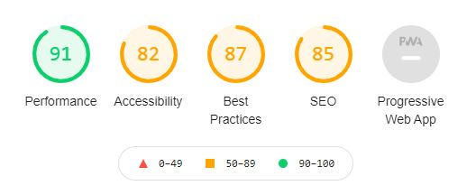

Desktop: 

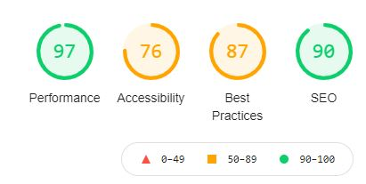

### Accessibility Validation

I tested the accessibility of the site using [Wave](https://wave.webaim.org/) which noted that the white logo didn’t have a strong enough contrast against the homepage background. This was addressed and the logo changed to a darker colour and retested, resulting in it passing. 

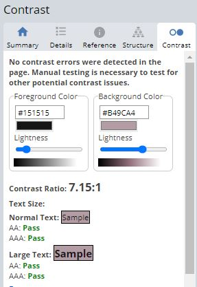

### Browser Validation

* Google Chrome
* Microsoft Edge
* Safari
* Firefox

The site was tested on the above browsers and found compatible.

[Back to Contents](#contents)

### User testing

I asked a peer on Slack to review the project. She confirmed that she liked “the layout and the colour scheme, and that it was light and easy to perceive. The UX is good for me as for user. I have tested the website and everything works fine”

User story tests on the above user stories:

These were tested through development, but have tested them all as the end of the project here too.

VIEWING AND NAVIGATION

As a **shopper** I want to be able to:

* View a list of products	so I can browse all products and determine what I want to purchase

The user can select ‘Shop Now’ on the main homepage which directs them to a full products page. This page shows rows of products with an image, title, price and category.

This user story is achieved. 

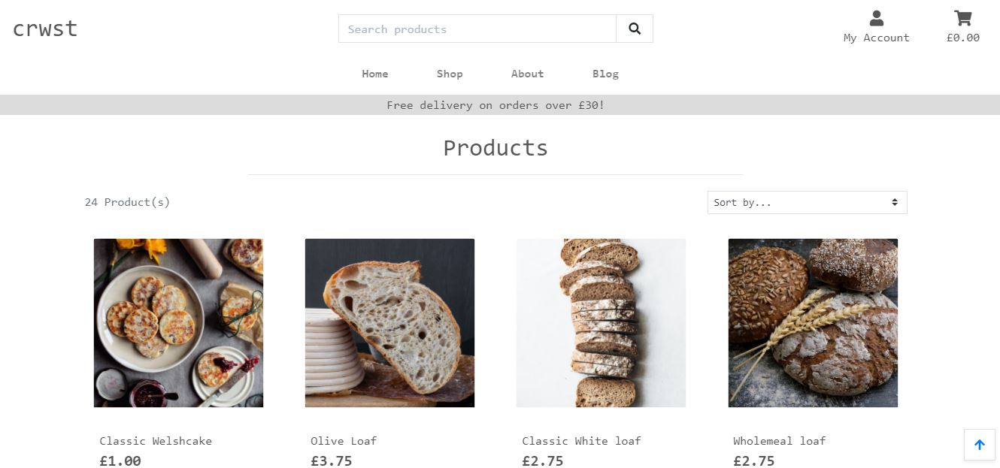

* View individual product details to identify the product price, description and an image to see what it looks like
A user can click a product on the full products page which takes them to that products individual detail page. 

This user story is achieved. 

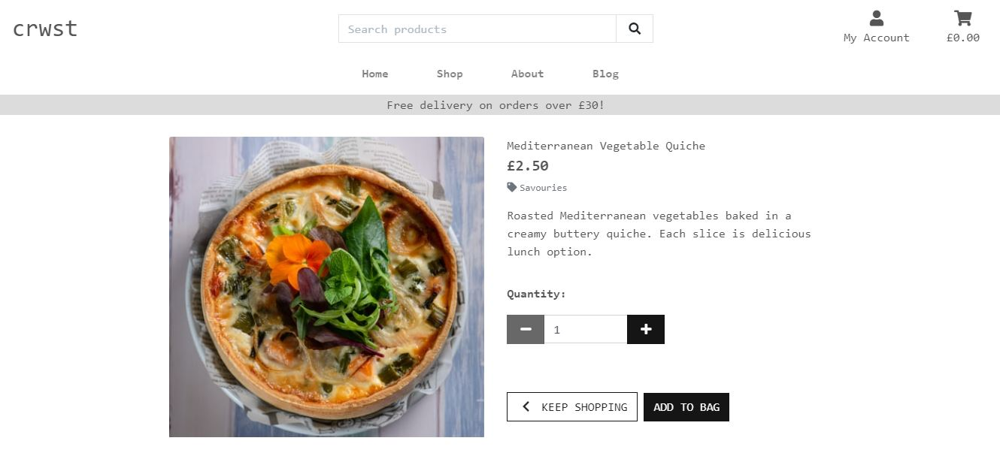

* View a category of products so I can easily find what I am looking for 

A user can sort the products into 3 categories from both the Shop dropdown menu in the main navigation and again to the top right of the search results; bakes, breads and savouries to help them narrow down their search. These results can be further sorted by price and alphabetically.

* Quickly identify deals, offers, bestsellers, clearance items so that I can take advantage of special savings I can make on purchases

A part of the base template under the menu, is a special offers banner, which on hover transitions to a larger scale. On click, this takes the user to the full list of products. 

This user story is achieved. 

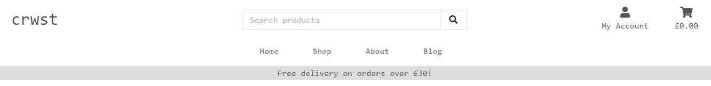

* Easily view the total cost at any time so that I avoid spending over my budget

When an item is added to the cart, the cart icon becomes bolder in style and the total of items in the cart is shown. This means a user can see the total at any time. 

A future feature could be the total number of items as well as the total cost. 

This user story is achieved but can be further improved in a future release.

* Read about local ingredients, the company and baking in general so that I can look for new recipes, educate myself

There is a blog page which the user accesses from the main menu. From this page the user can search for keywords, which searches the blog titles and texts, and shows the results. It also shows the number of results. 

For a future release, it would be great to have images, to be able to sort the blog results and to be able to search for them in the main site search bar. 

But for now this user story is satisfied. 

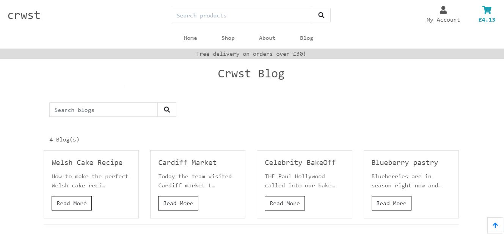

* Find out more about the brand to learn more about what they offer and determine if I want to purchase from them

A user can navigate to the ‘About’ page from the main menu. This shows a friendly team image, includes a description of the brand, a link to the bakery on google maps (that opens in a new tab) and opening hours. 

This user story is achieved. 

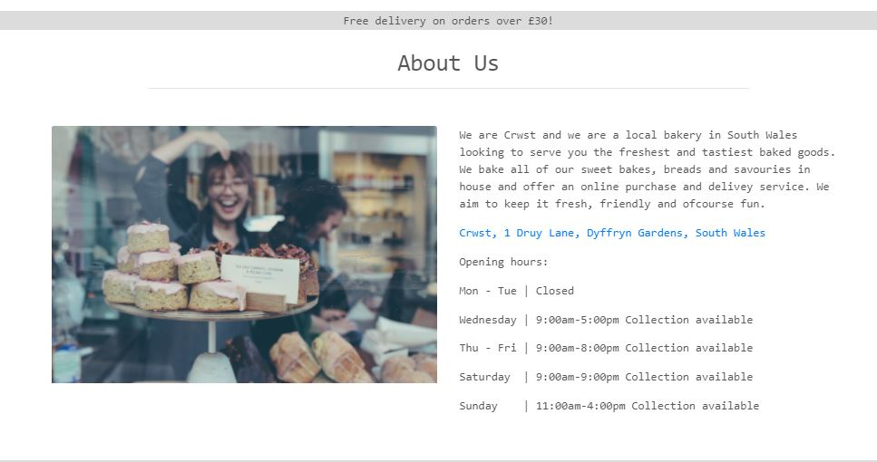

* Contact the bakery for further details about their products/an order I made

Within the base template there is a footer including contact details and social media links.  These are conventional and depending on the country and industry a legal requirement to include contact details. A user can navigate here for this information. 

This user story is achieved. 

REGISTRATION AND USER ACCOUNTS

As a **site user** I want to be able to: 

* Easily register for an account and be able to view my profile

The user can navigate to ‘My Account’ in the main menu and opt to sign in. The used allauth Django app gives the functionality for the user to securely sign in. The user has a profile once signed up and will be shown in a later user story.

This user story is achieved.

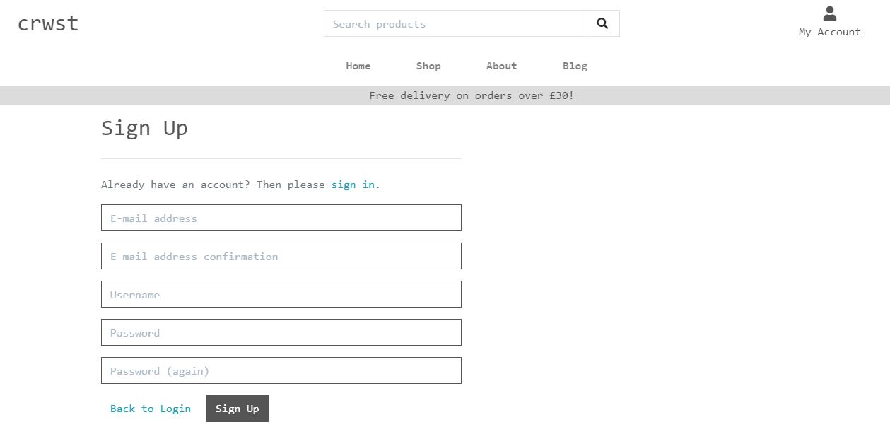

* Easily log in and out so I can access my personal account information 

The user can navigate to ‘My Account’ in the main menu and opt to log in. The used allauth Django app gives the functionality for the user to securely log in

This user story is achieved. 

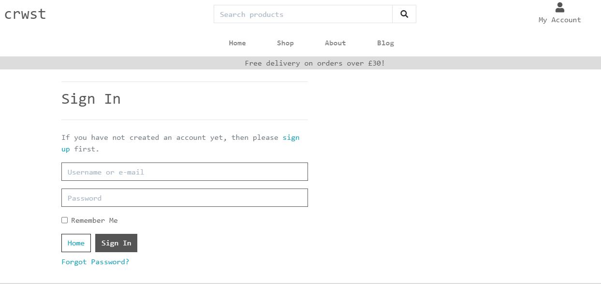

* Receive an email confirmation after registration to verify that my account registration was successful

Once successfully signed up, a user receives a confirmation email, with a link to verify the account. There is also a toast success message to confirm where the confirmation email has been sent. 

This user story is achieved. 

* Have a personalised user profile to view my personal order history and order confirmations 

The user can navigate to their profile from the ‘My Account’ in the main menu. They can see their default details in a form (if previously saved) or add/update as they wish. They are also able to view their order history. The order history includes a link to the order confirmations. 

This is restricted so that only the logged in user can see their orders. This prevents users bypassing this authentication via the URL and breaching security by seeing a customers data. In addition I have allowed superusers to be able to see these orders for management purposes.

This user story is achieved.

* Update my personal details so that I have up-to-date records

The user can navigate to their profile from the ‘My Account’ in the main menu. There is a form that is prepopulated if they chose to save their details and can be overridden and updated with new ones. 

This user story is achieved. 

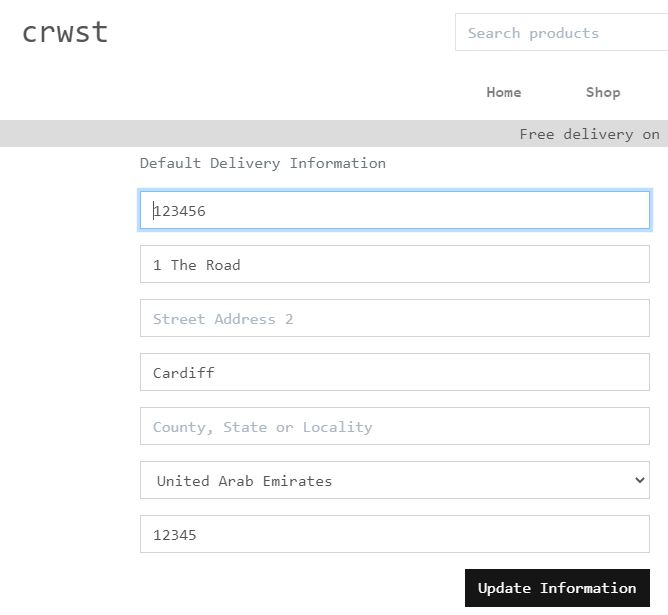

* Reset password so that I can change my password frequently for added security 

A logged in user can navigate to the account link in the navigation and see ‘Reset Password’ as a drop-down option. This allows a logged in user to change their password frequently if they wish. Once changed, they can redirect back to their profile.

Although they are asked for their current password, for added security, in a future release, adding email verification at this stage would be best for authentication.

For now however, this user story is achieved.

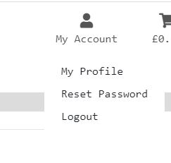

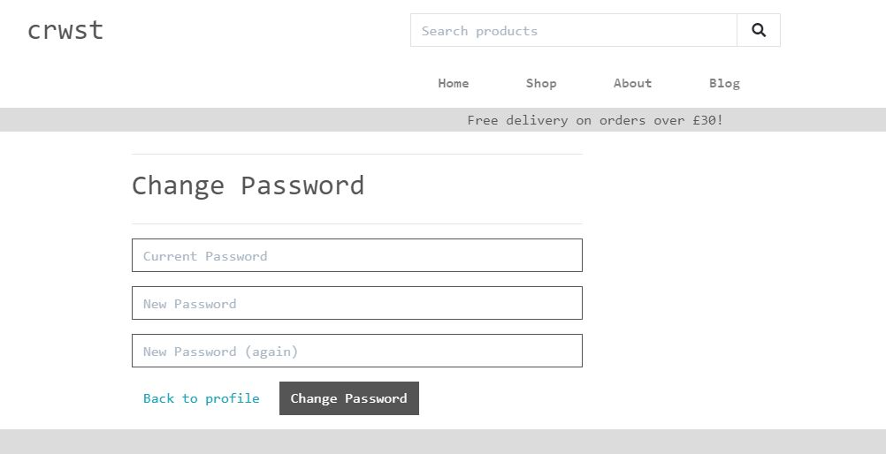

* Easily reset a forgotten password so that I can securely recover access to my account

When navigating to sign in, there user is presented with a link to ‘forgot password’. If clicked, they are asked for their email address and they are sent an email verification link. This link takes them to remake a new password which they can then sign in from. 

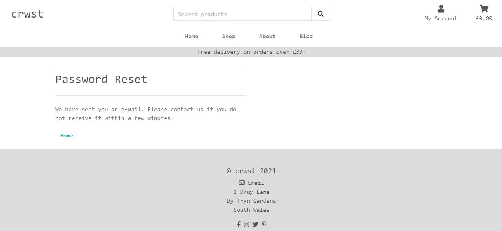

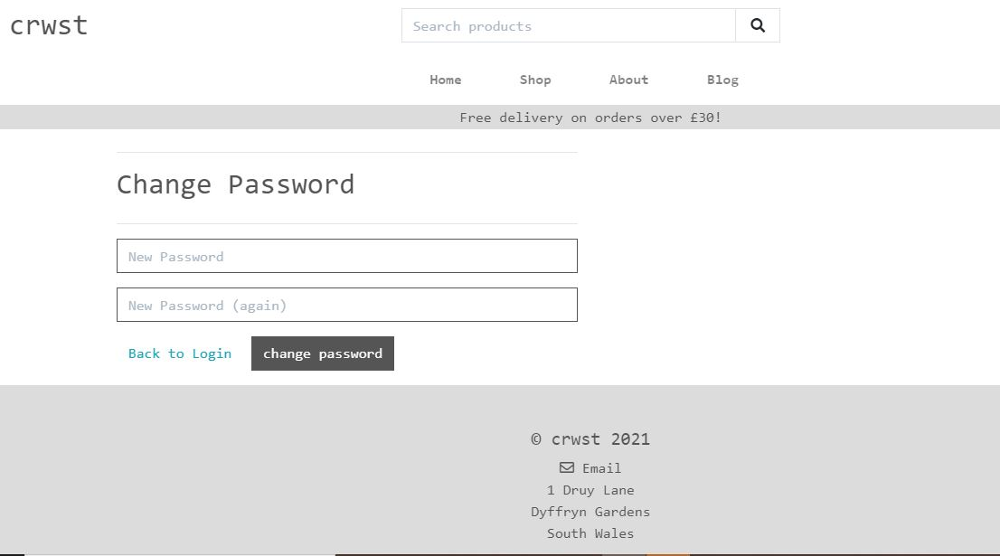

SORTING AND SEARCHNG

As a **shopper** I want to be able to:

* Sort the list of available products so I can easily identify the best price and categorially sorted products

Users can sort by the title alphabetically (A-Z and Z-A), by price (low to high and high to low) and by category alphabetically (A-Z and Z-A). 

This user story is achieved. 

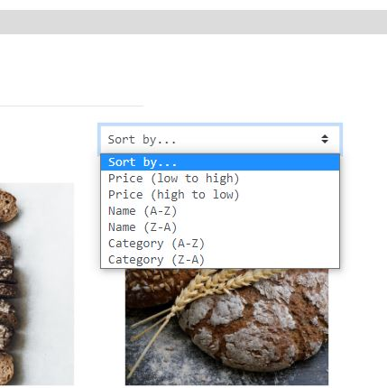

* Sort a specific category of product so that I can find the best priced product in a specific category or sort the products in that category

Users can sort category and then sort the results by the title alphabetically (A-Z and Z-A), by price (low to high and high to low) and by category alphabetically (A-Z and Z-A). 

This user story is achieved. 

* Search for a product by name or description to find a specific product

Users can use the search bar on any page, which is in the base template, to search for a specific product. This searches against the title and description to maximise search results. 

This user story is achieved. 

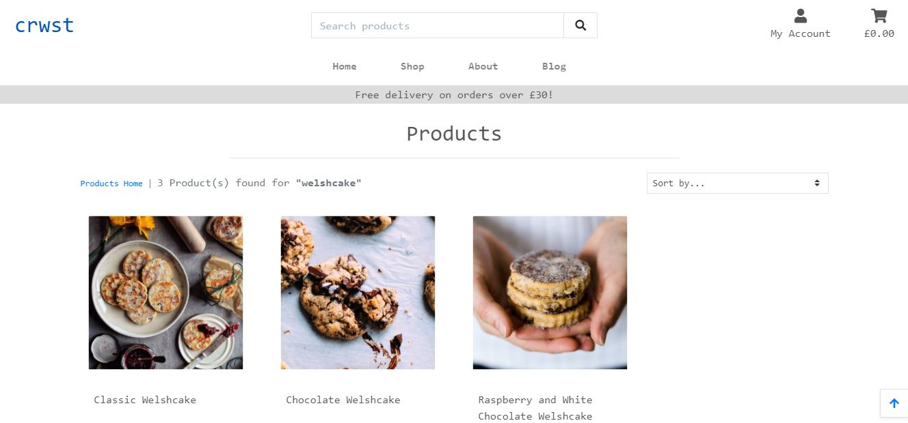

* Easily see what I have searched for and the number of results to quickly decide if the product I want is available

As above, when searching, the results are provided with a total of the number of results, a reminder of the search.

This user story is achieved. 

PURCHASING AND CHECKOUT 

As a **shopper** I want to be able to:

* Easily select the quantity of a product when purchasing it to ensure I don’t accidentally select the wrong product or quantity

A user can toggle the quantity that they wish to purchase on the products detail page as well as within the shopping cart. They can select update to amend the quantity and/or remove to remove it from their cart. This has been built so the number is restricted to between 1 and 99. This can be amended as per the site owner’s wishes. 

This user story is achieved.

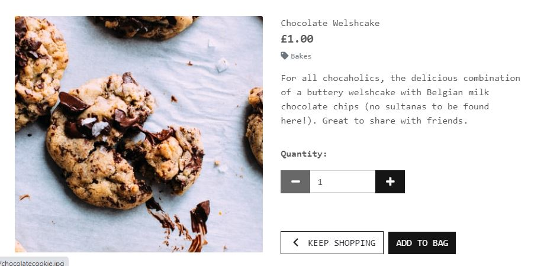

* View items in my bag to be purchased and identify the total cost of my purchase and all items I will receive

A user can navigate to their cart via the cart icon in the top right, or via the toast message that appears following the addition/update of their cart. The total cost is in the bag icon and in the cart page shows the subtotal, delivery cost and total charge. 

This user story is achieved. 

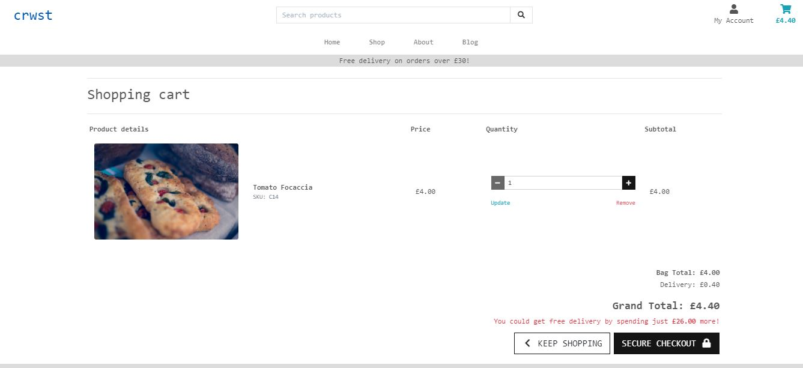

* Adjust the quantity of individual items in my bag to easily make changes to my purchases before checkout

A user can view items in the bag, update the quantity and/or remove the item. The user can update the quantity on selecting the update button, however some testers noted that they assumed the toggle would adjust this automatically. Although the test is satisfied in this scenario its something to think about for a future release. 

This user story is achieved. 

* Easily and safely enter my payment information to check out safely and securely

Currently this is using the Stipe test payment details.

A registered user is taken to a checkout page on clicking ‘Secure Checkout’ where they see a form for their details and a summary of their order. If they have saved their details previously they are prepopulated here. 

There is a payment form formatted conventionally. Currently this can be used using the Stipe test payment details.

Stripe has been used here for security. 

If a user is not registered, instead of 'Secure Checkout' they see a button that says 'Sign in to complete purchase' and are redirected to the sign in page. Whilst the redirect links here are not the smoothest UX, it does mean that only authorised users that have registered can make a purchase. This has also been tested by trying to bypass the URL which does not work and is therefore safe, this is built in both the html template and the python code.

If the payment details are invalid the user is given that feedback and asked to check their details.

This user story is achieved. 

* Feel that my payment and payment details are safe to confidently provide the details needed to make a payment 

When a user selects complete payment, they are presented with an overlay and animation, suggesting that the payment is processing. Users feel at ease when they can see an icon/animation suggesting that there is something happening even though they cannot see anything. It adds to the feeling of security. 

The form format and payment field of the above user story adds to this experience too. 

If the payment details are invalid the user is given that feedback and asked to check their details.

This user story is achieved. 

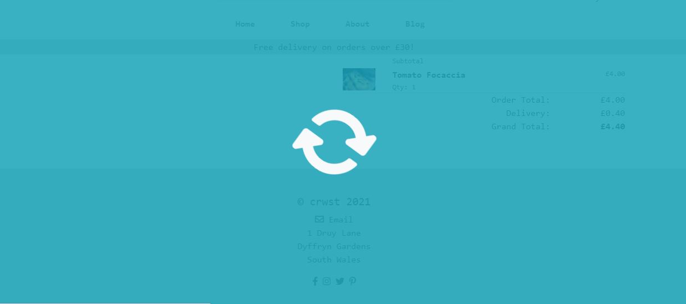

* View an order confirmation after checkout to verify that I haven’t made any mistakes and that the order has been successfully processed

If a payment and order has been successful, the user will see an order confirmation with full details of their purchase and a toast success message.

If the payment or order details are invalid the user is given that feedback and asked to check their details.

The checkout success view is defensively programmed so that only the creator of the order or a superuser can see this. It is so the url cannot be bypassed and sensitive data isn't visible.

This user story is achieved. 

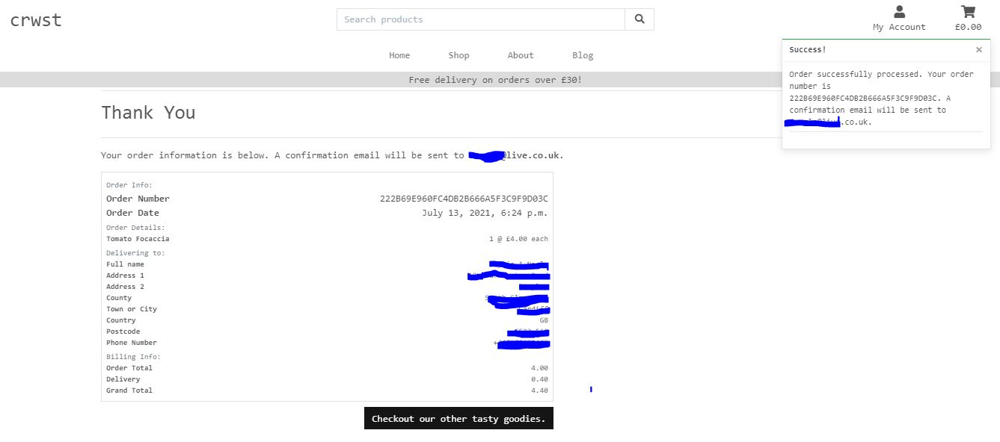

* Receive an email confirmation after checkout to keep a record of my purchases for confirmation

On successful completion of an order the user receives an email confirmation to their input email address. 

This user story is achieved. 

ADMIN AND STORE MANAGEMENT

As a **store owner** I want to be able to:

* Add a product to add new stock to the store 

A superuser (and only a superuser) can add navigate to product management via their account and add a product. They are redirected to this new product page.

This user story is achieved. 

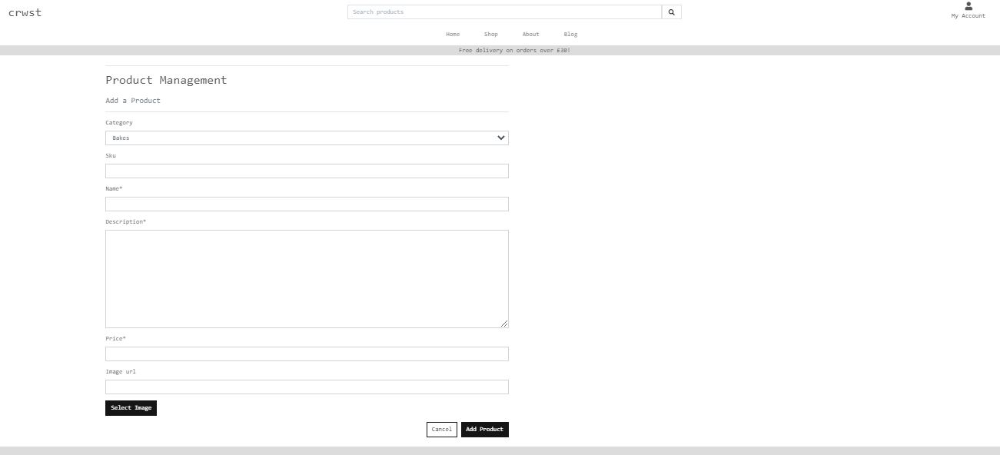

* Edit or update a product to change prices, images, and/or other criteria

When viewing products superusers have additional edit links where they can navigate to an edit page to update a product as they wish. This is the same form format as the add page.

This user story is achieved. 

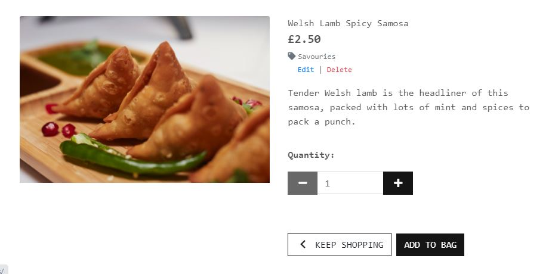

* Delete a product to remove items that are no longer available 

Like editing, when viewing products superusers have additional delete links where they can delete a product if they wish. They are prompted with a check before the item is actually deleted for security and enhanced UX. 

This user story is achieved. 

* Add a blog to the store 

A superuser (and only a superuser) can add navigate to blog management via their account and add a blog. They are redirected to this new blog page.

This user story is achieved. 

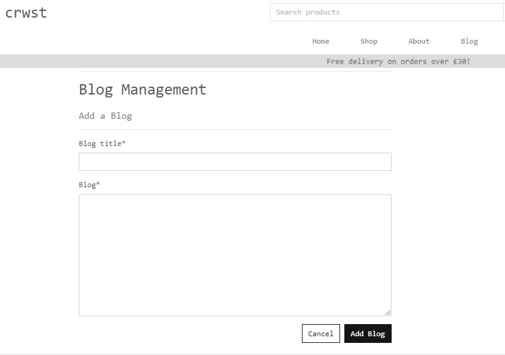

* Edit or update a blog 

When viewing blogs superusers have additional edit links where they can navigate to an edit page to update a blog as they wish. This is the same form format as the add page.

This user story is achieved. 

* Delete a blog

Like editing, when viewing products superusers have additional delete links where they can delete a product if they wish. They are prompted with a check before the item is actually deleted for security and enhanced UX. 

This user story is achieved. 

* Have a blog page and be able to add blog posts	 so that my shoppers have frequent fresh content on the site
This is achieved in the above.

[Back to Contents](#contents)

### Debugging

The following are bugs that I worked through in development. 

* Bootstrap 4.6 v 5 

Although Bootstrap5 is the latest (current) version, this project was started with 4.6 so will be continuing to be used throughout. This initially caused several bugs in display as the class names vary between versions. However, these were quickly rectified by revering to the Bootstrap 4.6 CDN. Note that classes are as per 4.6 and would need to continue to be unless all and CDN were changed. 

* Mobile navigation

I expected the navigation to be visually aligned however the menu options overflowed. This was tested with various paddings, margins and alternate bootstrap classes however I resolved it by amending the ul (unordered list) to have 0 margin and 0 padding. 

* Quantity toggles 

The quantity toggle enable and disable function in JavaScript didn’t work as the site allowed me to adjust the quantity below 0 and over 99. On reading the code I found there was a literal bug in that a letter was missing. 

* Shopping Cart

When making the shopping bag template responsive, the JavaScript that provided the functionality for restricting the quantity to 0 < n < 100 no longer worked on tablet/medium or larger screens. To check this, I ran the code with print statements in the console and found it wasn’t printing. In looking at the HTML I noticed that the duplication of the Quantity control code had duplicated the IDs which were used in the JS. To try to resolve this, I duplicated the code and changed the ID’s for small screens. This still did not work, and on re-reading the code I noticed I had kept the function names the same (different functionality) which meant it would not function correctly. I then changed the function name and it now works. I then deleted the original quantity form template includes html template as it cannot be used without functionality. 

On testing again, this bizarely did not work. To recitfy this, I created a new file to hold the JavaScript for small screens in a separate includes file whilst using the same functions with different IDs. I tested again with print statements and on reaching out to slack noted that it was possible a cache issue. For example, it worked on my computer and whilst testing responsivly with Google, however other users tested on alternate machines and had issues where the quantity would increase and decrease in twos. 

On reaching out again I found this is a known unresolved bug. I reverted the code and site back meaning the toggle restrictions work on mobile however not on tablet and desktop. This is something to look at on future release and restructuring that whole page. 

* Stripe Elements Payment

The payment input field wasn’t appearing in the browser. I checked the console with print statements and re-read the code and found that the API was in small letters instead of capitals (I have not included image here for security reasons)

* Stripe JS Submit payment 

Further to the above, there was another bug in that the payment field again wasn’t functioning as on submit nothing happened. Trying various print statements through the code and variations did not highlight anything but strangely the form worked when then ‘form.submit().’ function was removed. 

        $('#submit-button').attr('disabled', false);
    } else {
        if (result.paymentIntent.status === 'succeeded') {
            // form.submit();
        }
    }

This commented out code resulted in a successful payment in Stripe. However this is incorrect so I tried to change the code to the below… } else { form.submit():  which resulted in a successful payment…which again is technically incorrect.

        $('#submit-button').attr('disabled', false);
    } else {
        // form.submit();
        }
    }

It hadn’t worked because the function had not been set up fully in the views.py. Once it had, and the else if was reinput in stripe_elements.js, it worked correctly. 

        $('#submit-button').attr('disabled', false);
    } else {
        if (result.paymentIntent.status === 'succeeded') {
            form.submit();
        }
    }

* Git pull - Stripe

During Stripe Webhook testing files were accidentally added then unstaged, so needed to be pulled back to restore the correct files.

* Stripe Webhook

When progressing with work in the checkout the /wh link was not appearing in the terminal. Checking gitpod and my Stripe dashboard, I needed to add a second stripe webhook listener in development as the gitpod endpoint link changed by one digit. I checked Stripe and the web address, noted the difference and created a new webhook. 

After deployment, on testing I noted the stripe payment succeed webhook was now failing and the order email was not being sent (however the order confirmation was still showing in the browser and was correctly saving to the database). Registration emails were working, and all other webhooks were successful so it meant the issue was likely to be in checkout/views.py or the webhook_handler.py. To resolve this, I checked the code, checked my stripe keys and put print statements in to determine the email address and whether it was being picked up correctly. The keys were correct, the logic of the code was correct and it was picking up the correct email address however the email was not still not being sent. Stripe noted that it was resulting in a 500 server error, so although from the front end and database the order was succeeded there was still an issue. After trying to override this in the view and sending the email from there (and failing) I reached out to student support who checked with me and ran tests whilst logged in in heroku in the terminal. It was found that I had a syntax error as had some commas after variable declarations that shouldn't have been there which were breaking the webhook;

    checkout/webhook_handler.py, Line 79

    # Incorrect with commas 
    profile.default_phone_number = shipping_details.phone,
    profile.default_country = shipping_details.address.country,
    profile.default_postcode = shipping_details.address.postal_code,
    profile.default_town_or_city = shipping_details.address.city,
    profile.default_street_address1 = shipping_details.address.line1,
    profile.default_street_address2 = shipping_details.address.line2,
    profile.default_county = shipping_details.address.state,

    # Corrected code
    profile.default_phone_number = shipping_details.phone
    profile.default_country = shipping_details.address.country
    profile.default_postcode = shipping_details.address.postal_code
    profile.default_town_or_city = shipping_details.address.city
    profile.default_street_address1 = shipping_details.address.line1
    profile.default_street_address2 = shipping_details.address.line2
    profile.default_county = shipping_details.address.state
    profile.save()

 I was still getting a 200 successful result though because stripe sent a second webhook which was being successfully handled by this route:

    checkout/webhook_handler.py Line 37
    
    def handle_event(self, event):
            """
            Handle an unknown/unexpected/generic webhook event
            """
            return HttpResponse(
                content=f'Unhandled webhook recieved: {event["type"]}',
                status=200)

Once rectified and tested again, the email confirmation sends correctly, the webhook succeeds and the order correctly saves in the database.

* Blog comment 

When publishing a comment the URL not was not redirecting to the same blog page with the comment published as intended.  Using the blog code suggestion (in the link noted in credits) that suggested return redirect(f’blog/{_id}/) however we need to include the full url for this to work with the url patterns of this project. The id is coming directly from the original url and the code is shown below.

    if request.method == "POST":
        form = CommentForm(request.POST)
        if not request.user:
            messages.error(request,
                           'Sorry, only registered shoppers can do that.')
            return redirect(reverse('blogs'))
        if form.is_valid():
            comment_variable = Comment(author=request.user,
                                       comment_text=form.cleaned_data[
                                           'comment_text'
                                           ],
                                       blog=data)
            comment_variable.save()
            messages.success(request, 'Successfully added comment!')
            return redirect(f'/blogs/blog/{_id}/')

* On testing, following a password reset, when a user was presented with a sign in button, the link wouldn't work. There was no 'error', but on inspecting the elements the link provided by allauth wasn't coming through. I resolved this by adding an a tag and including a direct url link. Whilst this works for now, as it is automatically generated by allauth this bug should be revisted and tested to determine why it didn't work.

        <button class="primaryAction btn-style" type="submit"><a href="">Sign in</a></button>

* On further testing, published blog comments were not styled well for responsive screens (mobile and tablet). I put the comment code into a div and added bootstrap's margin left class and chose 3 (ml-3).

* On testing URL bypassing and security I noted that users can bypass order confirmation and checkout success. This would mean they can find sensitive details of other users, and once viewed (if they have an account) the order attaches to their profile. To try to resolve this, I included @login_required to the functions, on testing this only stoped non-logged in users bypassing however logged in users can override other users.

* On testing as the sticky class is used on the footer, this is displayed mid page on templates with shorter content which doesnt look appealing. To resolve this I have added a class wholePage with style height: 100vh; which means the footer reamins on the bottom for these particular templates.

[Back to Contents](#contents)

[Return to README.md file](https://github.com/sophnagle/crwst/blob/master/README.md#testing-and-debugging)

